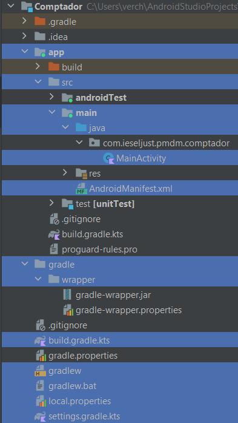
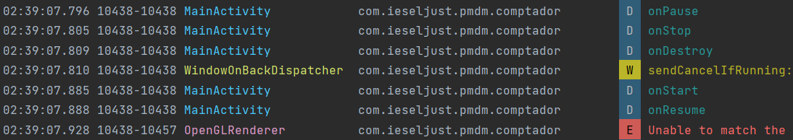

<h1 align="center">Practica Ampliant el comptador</h1>

## 1. Anàlisi de l’estructura del projecte

Es un projecte per a smartphones amb SO Android.
La següent captura mostra l'estructura del projecte. (Els archius i carpetes mes importants estan marcats en blau)

 

Si es volguera afegir altra activitat a mes de crear el fitxer amb la classe i el layout s'hauria de fer
una modificacio a l'arxiu "AndroidManifest.xml

## 2. Análisi del clicle de vida i el problema de la pèrdua d’estat

Despres d'analitzar el cicle de la vida mitjançant el log es pot observar que despres de pasar per el metode 
onStop() pasa directament al metode onDestroy() i despres l'aplicacio torna a començar, per eixe motiu es
que no es conserva l'estat.



## 3. Solució a la pèrdua d’estat

Per evitar que el comptador es reinicie quan es gire la pantalla, es pot guardar i restaurar l'estat de l'activitat. 
Ho podem fer utilitzant el mètode onSaveInstanceState per guardar el valor del comptador abans que 
l'activitat es destrueixi i onRestoreInstanceState per restaurar el valor després que l'activitat es recreat.
Per a solucionar el problema afegim el següent codi:
```kotlin
    override fun onSaveInstanceState(outState: Bundle) {
        // Es guarda el valor del comptador antes de que l'activitat se destrueixi
        outState.putInt("comptador", comptador)
        super.onSaveInstanceState(outState)
    }

    override fun onRestoreInstanceState(savedInstanceState: Bundle) {
        // Es restaura el valor del comptador despres de que l'actividad s'ha recreat
        super.onRestoreInstanceState(savedInstanceState)
        comptador = savedInstanceState.getInt("comptador")
        // Referencia al TextView
        val textViewComptador=findViewById<TextView>(R.id.textViewComptador)
        textViewComptador.text = comptador.toString()
    }
```

## 4. Ampliant la funcionalitat amb decrements i Reset

Despres de modificar el layout implementem la funcionalitat dels botons al codi del programa 
(afegim el següent)
```kotlin
        val btResta=findViewById<Button>(R.id.btResta)

        btResta.setOnClickListener {
            comptador--
            textViewComptador.setText(comptador.toString())
        }

        val btReset=findViewById<Button>(R.id.btReset)

        btReset.setOnClickListener {
            comptador=0
            textViewComptador.setText(comptador.toString())
        }
```
Primer fem les referencies als botons tant de restar com el de reset, despres invoquem amb cada boto al
metode setOnClickListener() i en cada un restem o posem el contador a 0 respectivament.

## 5. Canvis per implementar el View Binding
Despres d'aplicar el View Binding el codi deuria quedar aixi:
```kotlin
package com.ieseljust.pmdm.comptador

import android.os.Bundle
import android.util.Log
import androidx.appcompat.app.AppCompatActivity
import com.ieseljust.pmdm.comptador.databinding.ActivityMainBinding

class MainActivity : AppCompatActivity() {

    var comptador=0
    private lateinit var binding: ActivityMainBinding

    override fun onCreate(savedInstanceState: Bundle?) {
        super.onCreate(savedInstanceState)
        setContentView(R.layout.activity_main)
        binding = ActivityMainBinding.inflate(layoutInflater)
        val view = binding.root
        setContentView(view)
        binding.textViewComptador.text = comptador.toString()
        binding.btAdd.setOnClickListener {
            comptador++
            binding.textViewComptador.text = comptador.toString()        }

        binding.btResta.setOnClickListener {
            comptador--
            binding.textViewComptador.text = comptador.toString()        }

        binding.btReset.setOnClickListener {
            comptador=0
            binding.textViewComptador.text = comptador.toString()        }

    }

    val Any.TAG: String
        get() {
            val tag = javaClass.simpleName
            return if (tag.length <= 23) tag else tag.substring(0, 23)
        }

    override fun onStart() {
        super.onStart()
        Log.d(TAG, "onStart")
    }

    override fun onResume() {
        super.onResume()
        Log.d(TAG, "onResume")
    }

    override fun onPause() {
        super.onPause()
        Log.d(TAG, "onPause")
    }

    override fun onStop() {
        super.onStop()
        Log.d(TAG, "onStop")
    }

    override fun onRestart() {
        super.onRestart()
        Log.d(TAG, "onRestart")
    }

    override fun onDestroy() {
        super.onDestroy()
        Log.d(TAG, "onDestroy")
    }

    override fun onSaveInstanceState(outState: Bundle) {
        // Es guarda el valor del comptador antes de que l'activitat se destrueixi
        outState.putInt("comptador", comptador)
        super.onSaveInstanceState(outState)
    }

    override fun onRestoreInstanceState(savedInstanceState: Bundle) {
        // Es restaura el valor del comptador despres de que l'actividad s'ha recreat
        super.onRestoreInstanceState(savedInstanceState)
        comptador = savedInstanceState.getInt("comptador")
        binding.textViewComptador.text = comptador.toString()
    }
}
```